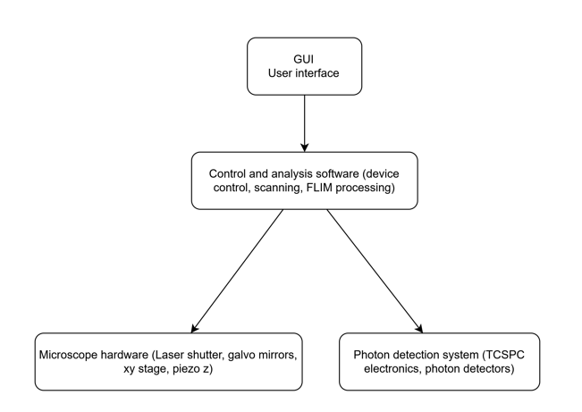
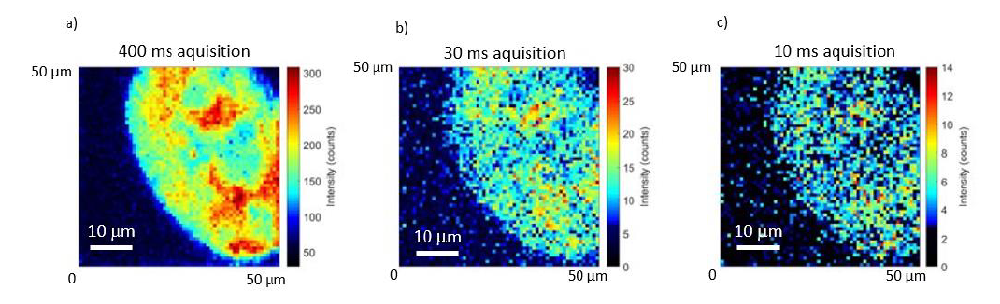
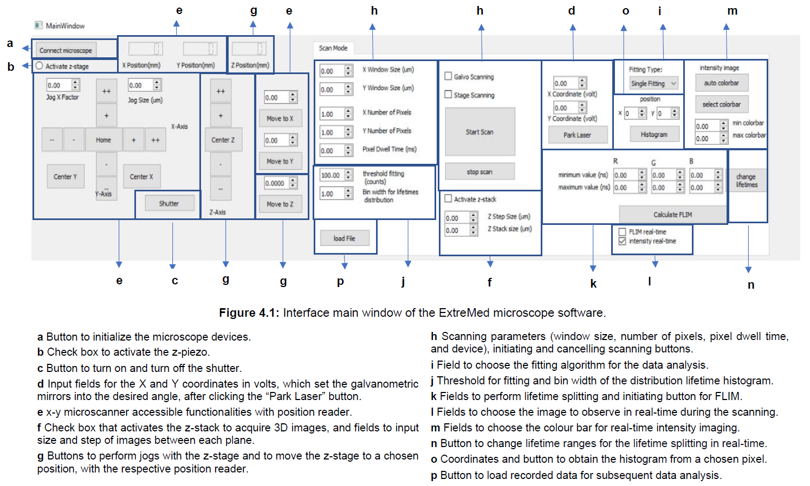

### Problem

The microscope combined several specialized subsystems that needed to work together reliably, including:

- femtosecond laser sources
- galvanometric scanning mirrors
- motorized microscope stages
- photon detectors
- time-correlated single photon counting (TCSPC) electronics

Off-the-shelf microscope software did not provide the flexibility required for this custom hardware configuration or for integrated real-time FLIM analysis. The project therefore required custom software capable of coordinating devices, managing scanning workflows, acquiring photon data, and processing fluorescence lifetime information during acquisition.

---

### Solution
I designed and implemented a modular autonomous software platform with a graphical user interface that integrates:

- device communication and control
- synchronized scanning workflows
- photon data acquisition
- real-time fluorescence lifetime computation
- live visualization and analysis tools

I structured the software as independent modules so new hardware, acquisition modes, and analysis workflows could be added without rewriting the full system.

---

### System Architecture

The software coordinates communication between the control computer and the main microscope subsystems, including:

- laser shutter
- galvanometric scanning mirrors
- motorized XY stage
- piezo Z-stage for depth scanning
- photon detectors
- TCSPC photon counting electronics

These components operate within a unified software environment that supports controlled scanning, synchronized photon acquisition, and real-time analysis.

<em>Figure 1. High-level architecture of the MP-FLIM control and analysis platform.</em>

---

### Device Control and Synchronization

I developed dedicated control modules for the microscope components using **manufacturer APIs and device libraries**. These modules supported:

- laser shutter control
- galvanometric mirror scanning
- stage positioning
- z-axis control for 3D imaging
- detector triggering
- synchronization with TCSPC electronics

This allowed multiple hardware interfaces to be integrated into one coordinated control platform rather than operated as separate tools.

---

### Scanning and Image Acquisition

The platform performs image acquisition through controlled scanning and synchronized photon detection.

Implemented capabilities include:

- beam scanning with galvanometric mirrors
- sample scanning with a motorized XY stage
- configurable pixel dwell time
- synchronized photon detection
- automated scan-grid generation

These acquisition modes supported different imaging configurations and experimental requirements through a unified user interface.

<em>Figure 2. Example output generated by the software, showing fluorescence lifetime analysis and visualization results.</em>

---

### Real-Time Fluorescence Lifetime Analysis

The platform processes photon arrival data in real time using **time-correlated single photon counting (TCSPC)** signals. Implemented analysis workflows include:

- photon-arrival histogram generation for each pixel
- exponential decay fitting
- fluorescence lifetime extraction
- generation of FLIM images during acquisition

This allowed researchers to assess fluorescence lifetime contrast while experiments were still running, instead of waiting for a separate post-processing step.

---

### Real-Time Visualization

The software provides live feedback during acquisition, including:

- fluorescence intensity images
- fluorescence lifetime maps
- photon-arrival histograms
- lifetime distribution plots

These views supported immediate assessment of image quality, signal quality, and lifetime contrast during experiments.

<em>Figure 3. Graphical user interface used to configure acquisition settings, control devices, and visualize results in real time.</em>

---

### Results

The platform was successfully applied in laboratory experiments with multi-colour labelled cellular samples.

It enabled:

- unified control of microscope subsystems
- synchronized scanning and photon acquisition
- real-time fluorescence lifetime visualization
- differentiation of multiple fluorophores using a single detector
- live experimental feedback during acquisition

The result was a single software environment that researchers could use to control the microscope, run synchronized acquisitions, and assess lifetime contrast while experiments were still in progress.

---

### Technologies

- Python
- hardware API integration
- TCSPC-based photon data acquisition
- real-time signal and image processing
- scientific instrumentation control
- GUI development

---

### Key Contributions

- designed and implemented the software platform for control and analysis of a multiphoton FLIM microscope
- integrated multiple microscope devices through **manufacturer APIs and device libraries**
- developed **real-time fluorescence lifetime analysis workflows**
- implemented synchronized **scanning and photon acquisition**
- structured the software into a **modular architecture** for maintainability and extension
- developed a **graphical user interface** for microscope control and live visualization

### Engineering Challenges

Key challenges included coordinating multiple hardware interfaces, ensuring reliable synchronization across acquisition components, and providing real-time feedback without interrupting the imaging workflow. I designed the platform to keep these responsibilities modular, making the system easier to maintain, extend, and adapt to future experimental requirements.
