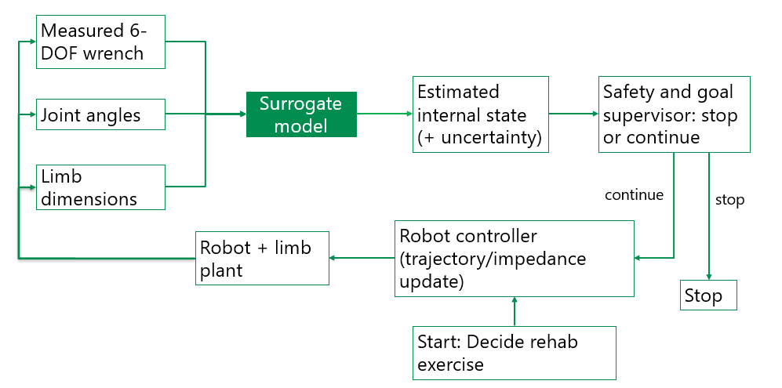

# Autonomous Rehabilitation Robotics

**Role:** Scientific Software Engineer / Research Software Developer  
**Focus:** Musculoskeletal simulation, automated dataset generation, AI surrogate-model pipeline, rehabilitation robotics  
**Environment:** Robot-assisted lower-limb rehabilitation

## Problem

Robot-assisted rehabilitation requires patient-specific predictions of biomechanical response and robot–limb interaction forces. Full musculoskeletal simulations can provide these outputs, but they are too computationally expensive for real-time use inside a robot control loop.

At the same time, autonomous robot software requires fast predictive models. A practical path toward this is to train AI surrogate models on simulation data. However, generating training data manually through repeated optimization runs is slow, labor-intensive, and difficult to scale across many motions and parameter combinations.

## Built

I developed a musculoskeletal simulation and automated data-generation workflow for rehabilitation motions, including lower-limb model selection, prescribed motion generation, 6-DOF attachment wrench estimation, and a software package that automates optimizer sweeps across varying parameters to generate structured training data for AI surrogate models.

## Outcome

Established the simulation backend for rehabilitation wrench estimation and surrogate-model development, while increasing automated data-generation throughput from approximately 10 to 20 simulation points per hour and removing the need for continuous manual supervision during optimizer sweeps.

## Stack

OpenSim, OpenSimCreator, Python, musculoskeletal modeling, optimization workflows, automated parameter sweeps, AI surrogate-model pipeline design, rehabilitation robotics

## Overview

This project supports the development of an autonomous lower-limb rehabilitation robot by providing the simulation and data-generation backbone needed for future real-time control.

My work focuses on building a musculoskeletal workflow that can generate structured biomechanical training data automatically. This includes selecting and adapting the simulation backend, generating rehabilitation-like motions, estimating the 6-DOF tibia attachment wrench, and automating optimizer sweeps across varying parameters.

The purpose of this workflow is to enable training of AI surrogate models that can later approximate simulation outputs fast enough for real-time, patient-specific robot control.

## Problem

Rehabilitation for intensive care and paraplegic patients is physically demanding and time-intensive, while therapy capacity is limited relative to rehabilitation need. Robotic systems can help offload repetitive work, but safe autonomous control requires estimates of quantities such as robot–limb interaction wrench and internal biomechanical response.

Full musculoskeletal simulations can provide these outputs, but they are too slow for direct real-time deployment. Surrogate models offer a path toward fast prediction, but they require large training datasets spanning different motions, scales, ROM values, and passive parameters.

Generating that data manually would require repeatedly changing parameters, launching optimization workflows, and collecting outputs by hand. This made the process slow, repetitive, and difficult to scale.

To support this project, the software workflow needed to:

- represent patient-specific variability such as scale, ROM, and passive parameters
- estimate therapy-relevant outputs for safe robot control
- support comparison of alternative wrench-estimation formulations
- generate consistent training data for future AI surrogate models
- automate parameter sweeps and optimizer runs
- prepare the workflow for validation against measured robot–limb forces

## Solution

I developed the musculoskeletal simulation backend around OpenSim, selected for its flexibility, model ecosystem, and suitability for simulation and optimization workflows. I then adapted the workflow for rehabilitation use by selecting a lower-limb model with extended ROM, generating prescribed rehabilitation motions, and implementing initial 6-DOF attachment wrench estimation workflows for the tibia attachment interface.

In parallel, I developed an automation package that runs optimizer-based simulation sweeps autonomously while varying parameters across defined ranges. This package removes the need to manually edit inputs and launch each run, making data generation faster, more reproducible, and far less labor-intensive.

The result is a computational foundation that supports prescribed-motion simulation, passive-response analysis, attachment-wrench estimation, benchmarking of alternative methods, and scalable automated dataset generation for AI surrogate-model training.

## Musculoskeletal Backend Selection

For the simulation backend, OpenSim was selected because it is open-source, widely used in the research community, and offers strong model availability and workflow flexibility for simulation and optimization.

For the lower-limb model, I selected Catelli-high-hip-flexion V4.0, derived from the Rajagopal model family and using the Millard2012EquilibriumMuscle formulation. This model was suitable because it supports larger rehabilitation-relevant ROM while preserving Hill-type muscle and tendon mechanics needed for passive-force analysis.

## Rehabilitation Motion Definition

As a proof of concept, the workflow focuses on supine hip flexion with knee flexion, a clinically relevant lower-limb mobilization exercise suitable for passive rehabilitation scenarios. Motion files are generated by prescribing hip and knee angle trajectories over time, providing consistent input motions for simulation and later automated parameter sweeps.

This establishes a controlled simulation input for evaluating how passive tissue response and attachment wrench vary with rehabilitation motion.

## Initial 6-DOF Attachment Wrench Estimation

A central goal of the project is to estimate the 6-DOF attachment wrench at the robot–limb interface — three forces and three moments at the tibia attachment — during prescribed motion. This quantity includes the effects of gravity, inertia, and passive internal forces, making it directly relevant for safe robot support and future autonomous control.

To explore robust estimation strategies, I implemented and evaluated several workflows, including constraint-based approaches, inverse-dynamics-style formulations, and optimization-based methods. The model was adapted in OpenSimCreator to support the frames, constraints, and actuators required for these alternatives.

## Constraint and Optimization Approaches

One class of tested methods used constraint reactions, where an external body attached at the limb interface mirrors the robot end-effector and allows reaction wrench estimation if the interface definition matches the physical interaction correctly. These approaches were feasible, but sensitive to frame definition, constraint setup, and interface modeling.

A second class of methods used optimization-based estimation, including Computed Muscle Control (CMC) and MocoInverse. In this formulation, a SpatialActuator is added at the attachment interface, and the optimizer solves for the time-varying 6-DOF wrench needed to track the prescribed motion while satisfying system dynamics.

Among the tested approaches, this optimization-based strategy proved the most robust in practice. CMC was used as an initial feasibility workflow, while a MocoInverse-based pipeline is being developed for more principled full-motion consistency.

## Automated Dataset Generation for AI Surrogate Models

A major part of the project is automatic generation of simulation data for AI surrogate-model training.

Training surrogate models requires large datasets covering many combinations of motion and model parameters. Initially, this process depended on manually changing parameters, launching optimization runs, and collecting outputs, which made it slow and difficult to scale.

To address this, I developed a software package that automates the simulation sweep workflow: it modifies parameters, runs the optimizer autonomously, and gathers the resulting outputs into structured datasets suitable for surrogate-model training.

This automation increased throughput from approximately 10 to 20 simulation points per hour while removing the need for continuous manual supervision. In practice, this made dataset generation faster, more reproducible, and more scalable.

## Passive Response and Training Data

The simulation workflow is also being used to identify outputs correlated with passive resistance, such as passive muscle stretch forces and other internal OpenSim quantities relevant to rehabilitation loading. This is important because passive internal loads are interconnected with the required 6-DOF attachment wrench.

Once the wrench-estimation workflow is validated, the same backend can generate consistent input-output data for AI surrogate-model training by sweeping across variables such as:

- motion profiles
- model scale
- ROM
- passive parameters
- attachment wrench outputs

This automated data-generation pipeline is intended to provide the training data needed for fast surrogate prediction in future autonomous robot software.

## Validation Workflow

A major next step is validation against experimental measurements. The planned protocol records measured 6-DOF wrench at the shin cuff together with kinematics, scales the model to the participant, aligns the attachment frame with the sensor, runs the optimizer on recorded motion, and compares predicted versus measured wrench in a common frame.

This validation step is essential before using the simulation outputs to train or rely on surrogate models for robot-assisted mobilization.

## Long-Term Objective

The long-term goal of the project is an autonomous rehabilitation robot that uses AI surrogate-model predictions inside the control loop to support safe, patient-specific mobilization in real time.

The simulation and automated data-generation workflow developed here provides the foundation for that next phase by supplying the training data and biomechanical outputs needed to build, validate, and integrate those models into future autonomous robot software.

<em>Figure 1. Planned control-loop for a rehabilitation robot with surrogate models' predictions.</em>

## Project Status

### Delivered

- OpenSim selected as the musculoskeletal simulation backend
- lower-limb model selected and adapted for rehabilitation ROM
- proof-of-concept rehabilitation motion generation implemented
- initial 6-DOF attachment wrench estimation workflow implemented for tibia attachment
- automated simulation sweep package developed for surrogate-model dataset generation

### In progress

- passive-parameter estimation
- validation of 6-DOF wrench estimation
- benchmarking of alternative wrench-estimation formulations
- expansion of the automated sweep pipeline for larger dataset generation
- AI surrogate-model training pipeline definition

### Next

- automatic patient scaling workflow
- surrogate-model training and evaluation
- integration of surrogate predictions into the control loop
- robot integration and controlled validation demo

## Technologies

- OpenSim
- OpenSimCreator
- Python
- musculoskeletal modeling
- prescribed-motion simulation
- CMC
- MocoInverse
- SpatialActuator-based wrench estimation
- automated parameter sweeps
- AI surrogate-model data pipeline design

## Key Contributions (summary)

- selected and configured the musculoskeletal simulation backend for rehabilitation use
- identified a lower-limb model suitable for rehabilitation-relevant ROM and passive-force analysis
- generated prescribed rehabilitation motions for proof-of-concept simulation
- implemented initial workflows for estimating 6-DOF attachment wrench at the tibia interface
- adapted the model to support multiple wrench-estimation formulations
- developed a package for autonomous optimizer-based parameter sweeps
- doubled simulation data-generation throughput from approximately 10 to 20 points per hour
- established the simulation basis for validation and AI surrogate-model training

## Engineering Challenges

Key challenges included defining a physically meaningful robot–limb interface inside the model, estimating a reliable 6-DOF attachment wrench under prescribed motion, handling sensitivity to frame and constraint definitions, and scaling the workflow from individual simulations into automated dataset generation for surrogate-model training.

Another major challenge was reducing manual intervention in repeated optimization runs. I addressed this by automating parameter variation, simulation execution, and output collection, making the workflow faster, more reproducible, and less dependent on constant user supervision.
