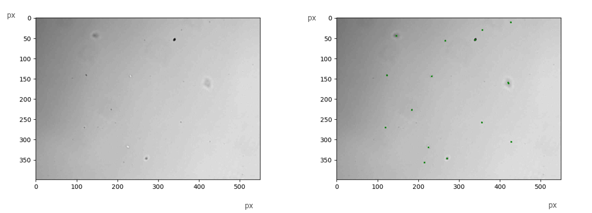
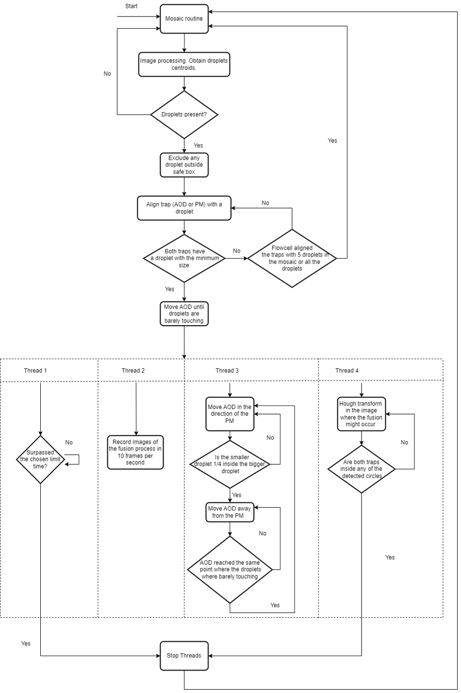
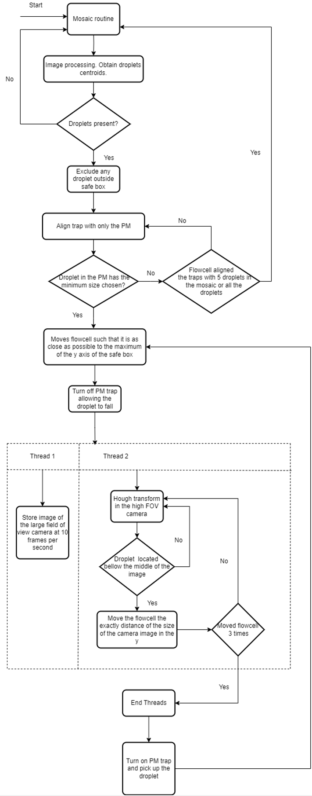
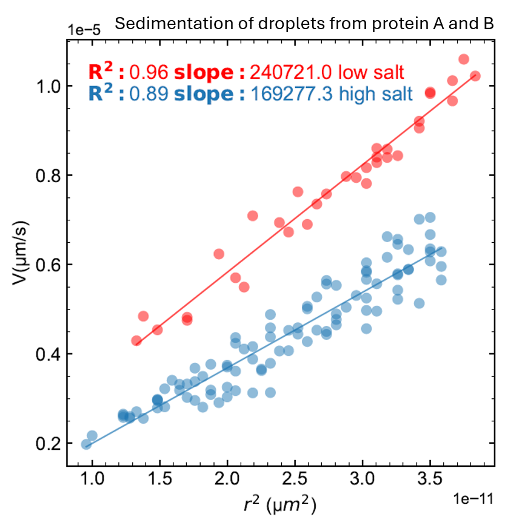
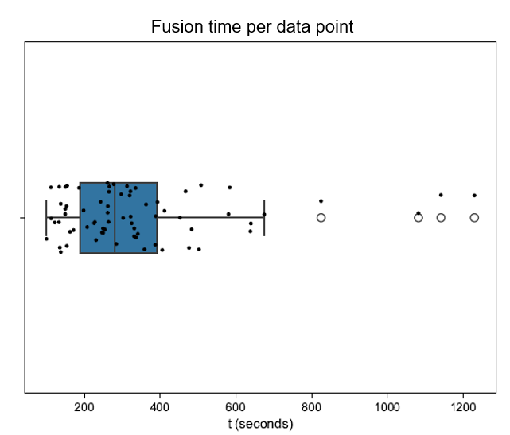
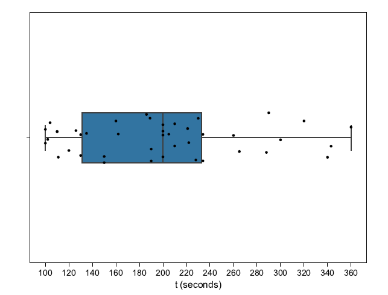

## Optical Tweezers Experiment Automation

**Role:** Software Developer / Automation Engineer  
**Focus:** Computer vision, hardware integration, workflow automation  
**Environment:** Optical tweezers experimental platform

**Problem**  
Optical tweezers experiments required continuous manual control, droplet selection, and manual data extraction, limiting throughput and requiring constant researcher supervision.

**Built**  
A modular automation platform integrating droplet detection, hardware control, automated droplet capture, experiment workflows, structured data generation, and graphical user interaction.

**Outcome**  
Automated nearly the full experimental workflow and achieved approximately **20 data points per hour** across fusion, sedimentation, and rheology measurements.

**Stack**  
Python, computer vision, YOLO-NAS, hardware APIs, socket communication, GUI development, automation workflows

### Overview

At the **Technical University of Dresden**, I developed a Python-based automation platform for optical tweezers experiments, integrating computer vision, device control, experiment orchestration, and automated measurement workflows.

The system unified droplet detection, hardware coordination, automated capture, experiment execution, and data generation into a modular software platform capable of running measurements with minimal user intervention.

Optical tweezers use highly focused laser beams to manipulate microscopic particles. In this setup, experiments were typically performed manually, requiring researchers to continuously monitor the sample, operate the instrument, and extract data during each run. The goal of this project was to replace that manual workflow with a reliable and extensible automation system.

---

### Problem

The experimental workflow depended on continuous manual control and manual data extraction, which reduced throughput and required researchers to remain at the instrument for long periods.

A practical automation system needed to:

- detect droplets reliably in live camera images
- distinguish valid droplets from debris and artifacts
- convert detections into stage movements
- coordinate multiple hardware devices through different vendor APIs
- execute measurement workflows automatically
- allow researchers to configure experiments through an accessible interface
- generate structured output data with minimal manual intervention

---

### Solution

I designed and implemented the automation software platform for the optical tweezers setup, integrating computer vision, device control, experiment orchestration, automated measurement routines, and graphical user interaction into a single system.

To improve maintainability and extensibility, the workflows were organized into modular software packages, making the platform easier to adapt to new hardware, measurement types, and experimental procedures.

A unified software layer coordinated heterogeneous hardware devices through their vendor APIs, enabling centralized control of the full setup.

---

### Impact

The platform automated nearly the entire workflow, replacing continuous manual operation with autonomous droplet detection, capture, and measurement execution while researchers could focus on other tasks.

During experimental use and testing, the system achieved an average throughput of approximately **20 data points per hour** across fusion, sedimentation, and rheology measurements, including droplet detection, capture, and preparation.

This reduced hands-on instrument time, increased experimental throughput, and made automated data generation more practical for routine use.

---

Some visual examples have been simplified or anonymized to respect institutional data policies. The focus of this project description is the software architecture and automation workflows.

### Droplet Detection

Reliable droplet detection was a core requirement for full automation. I developed and trained a **YOLO-NAS-based computer vision model** capable of detecting droplets in the live camera feed and distinguishing them from debris and other artifacts.

An automation workflow was built around this model to:

- detect droplets automatically
- extract center pixel coordinates
- convert image coordinates into motor positions
- enable automated droplet pickup using the laser trap

  

<em>Figure 1. Droplet detection using the trained YOLO-NAS model. Detected droplets were used to extract positions for automated pickup.</em>

---

### Automated Droplet Capture

I implemented an automated routine to capture droplets detected in the visual field. The algorithm determines whether a droplet is already trapped in the laser beam. If not, the system moves the motorized stage to the droplet position and captures it with the optical trap.

This process continues until all required laser paths contain droplets. The software also ensures that only droplets above a **user-defined minimum radius** are selected.

This routine formed a core control loop of the platform, linking computer vision output directly to automated motor positioning and trap loading.

---

### Measurement Workflows

Several measurement routines were implemented and exposed through the graphical user interface, including:

- fusion experiments
- sedimentation measurements
- rheology measurements

Each routine could be repeated a user-defined number of times for the same droplet before discarding it and repeating the process with a new droplet set.

A shared workflow framework supported all three measurement types, allowing the same software architecture to be reused across multiple experimental protocols.

The overall automation workflow for droplet capture and measurements is shown below.

  

<em>Figure 2. High-level automation workflow for droplet capture and measurement routines.</em>

An example of the sedimentation-specific workflow is shown below.

  

<em>Figure 3. Automation workflow used for sedimentation measurements.</em>

The software also generated structured output data for downstream analysis.

  

<em>Figure 4. Example output generated by the automated sedimentation workflow.</em>

The timing plots below illustrate the execution time of automated measurements for protein A.

  

<em>Figure 5. Time required to perform automated fusion measurements for protein A.</em>

  

<em>Figure 6. Time required to perform automated sedimentation measurements for protein A.</em>

---

### Logging and Traceability

The platform allowed users to define where experimental data should be stored during acquisition. In addition to measurement results, relevant system and experiment information was recorded in log files to support traceability and reproducibility.

---

### Safety Constraints

To reduce the risk of hardware damage, a safe operating region was implemented within the control software. This ensured that automated movements remained within safe boundaries and prevented invalid positioning commands.

---

### Microfluidics Integration

For reliable measurements, water had to remain between the optical tweezers objectives and the sample. This process was automated by integrating a **syringe pump**, eliminating the need for manual intervention during operation.

---

### Device Integration

The software automatically connected to the devices that compose the optical tweezers setup, including motors, cameras, syringe pumps, and other hardware components.

Communication and control were implemented through the available **device APIs and hardware libraries**, allowing the system to coordinate all components programmatically from the main software interface.

A **socket-based server architecture** was used to initialize, connect, and manage the devices within a unified control environment.

---

### Technologies

- Python
- GUI development
- Computer vision
- YOLO-NAS
- Hardware control
- Device APIs and libraries
- Socket communication
- Scientific data processing
- Automation workflows
- Modular software design

---

### Key Contributions

- Designed and developed the main automation software for optical tweezers experiments
- Developed a unified software layer to coordinate heterogeneous hardware devices through their vendor APIs
- Structured automation workflows into modular software packages for easier maintenance and adaptation
- Trained and integrated a YOLO-NAS model for droplet detection
- Implemented automated droplet capture and measurement workflows
- Integrated multiple hardware devices into a unified control system
- Implemented logging, safety constraints, and microfluidics support

### Engineering Challenges

Key challenges included reliable droplet detection in live microscopy images, translating image coordinates into physical stage movements, coordinating heterogeneous hardware through different vendor interfaces, and maintaining safe automated operation during repeated measurement cycles.

